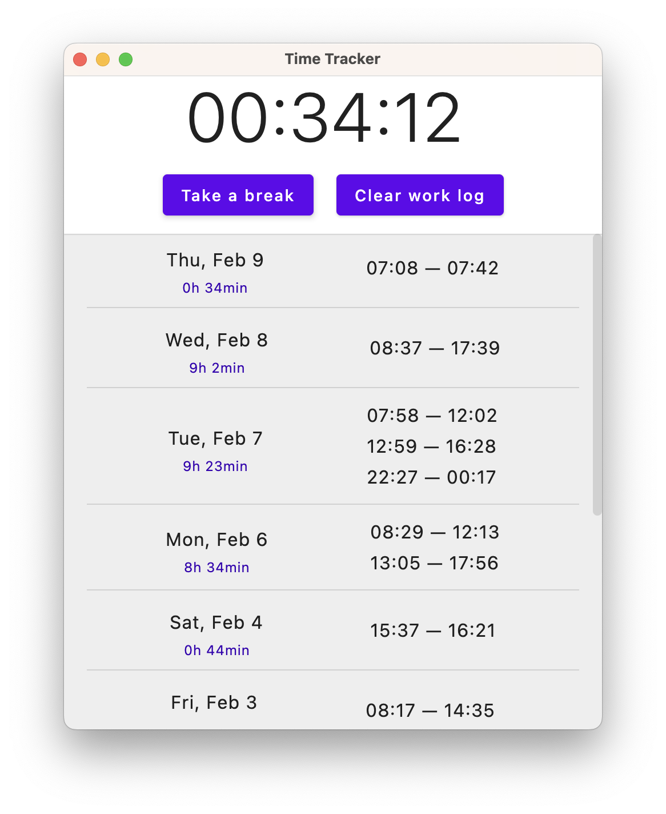

Time Tracker
============

This is a toy project for learning multiplatform development with Kotlin and Compose Desktop. It's pretty much what
you'd expect from the name: an app for logging work time.

### "Roadmap"

- [x] Basic UI and time keeping functionality
- [x] Persist state to disk, starting with JSON serialization
- [x] Unit test coverage on business logic
- [x] Improve UI: better layout, scrolling, duration summaries
- [ ] Basic CI using GitHub Actions
- [ ] Ability to edit work logs retroactively
- [ ] Switch to SQLite database for the backing store
- [ ] Additional multiplatform targets: native, JS?

### Screenshot

